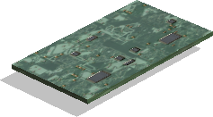

## IMU Sensors

IMU (Inertial Measurement Unit) sensors combine multiple proprioceptive sensors.
An [Accelerometer](../reference/accelerometer.md), a [Gyro](../reference/gyro.md) and a [Compass](../reference/compass.md) are generally all combined in one single sensor.
The IMU may also be equipped with a higher level layer allowing to get the attitude of the robot (roll, pitch, yaw), which is equivalent to the behavior of the [InertialUnit](../reference/inertialunit.md).
It is indeed possible to add each of these sensors manually.
Some predefined IMU models are present in Webots to simplify the user experience.

### MPU-9250

%figure "MPU-9250 model"



%end

The [MPU-9250](https://invensense.tdk.com/products/motion-tracking/9-axis/mpu-9250/) is a MEMS (Microelectromechanical systems) IMU device to track the orientation and motion of a body.
It is modeled as a solid chip embeding an [Accelerometer](../reference/accelerometer.md), a [Gyro](../reference/gyroscope.md) and a [Compass](../reference/compass.md) to retrieve, respectively, acceleration values in [m/s²], angular rates in [rad/s] and the vector indicating the north direction for heading.

%figure "Internal devices names"

| Device                            | Name                                      |
| --------------------------------- | ----------------------------------------- |
| Accelerometer                     |  "`Mpu-9250.name` accelerometer"          |
| Gyro                              |  "`Mpu-9250.name` gyro"                   |
| Compass                           |  "`Mpu-9250.name` compass"                |

%end

```
Mpu-9250 {
  SFVec3f    translation   0 0 0
  SFRotation rotation      0 0 1 0
  SFString   name          "MPU-9250"
}
```
